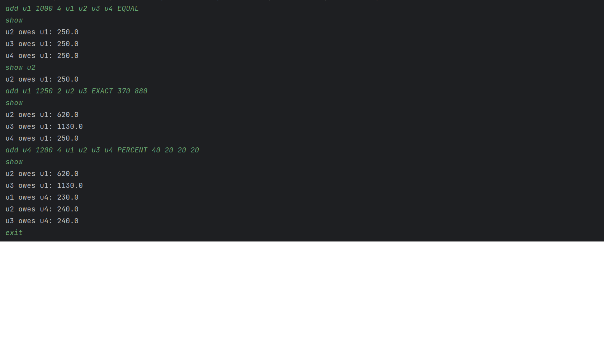

# Split Wise

This is the solution to a split wise machine coding question
https://workat.tech/machine-coding/editorial/how-to-design-splitwise-machine-coding-ayvnfo1tfst6

This input format will have three main input key

1. ADD
2. SHOW
3. QUIT

### For Add:
It will be in format
#### < input-key (value = ADD) > < paid-by > < amount > < total contributors > < contributors id > < split type > < contribution value (based on split type) >
split type values possible are (EQUAL, EXACT, PERCENT)
example = add u1 1000 4 u1 u2 u3 u4 EQUAL

### For Show:
It will be in format
#### <input-key (value = SHOW)> <user id (optional)>
example = show

### For Quit:
It will in format
#### <input key (value = Quit)>
example = quit

Just install the app and run the function

